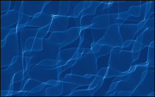

# 2020_caustiques

[](https://zenodo.org/badge/latestdoi/273226625)


Caustics ([wikipedia](https://en.wikipedia.org/wiki/Caustic_(optics))) are luminous patterns which are resulting from the superposition of smoothly deviated light rays. It is the heart-shaped pattern in your cup of coffee which is formed as the rays of from the sun are reflected on the cup's surface. It is also the wiggly patterns of light that you will see on the floor of a pool as the sun's light is *refracted* at the surface of the water. Here we will simulate this particular physical phenomenon. Simply because they are mesmerizingly beautiful, but also as it is of interest in visual neuroscience. Indeed, it speaks to how images are formed (more on this later), hence how the brain may understand images.

In [this post](https://laurentperrinet.github.io/sciblog/posts/2020-06-19-caustic-optics.html), I will develop a simple formalism to generate such patterns, with the paradoxical result that it is *very* simple to code yet generates patterns with great complexity, such as:

<BR>
<center>

</center>
<BR>

This is joint work with artist [Etienne Rey](https://laurentperrinet.github.io/authors/etienne-rey/), in which I especially follow the ideas put forward in the series [Turbulence](http://ondesparalleles.org/projets/turbulences/).

## installation

Install [dependencies](https://pip.pypa.io/en/stable/user_guide/#requirements-files), then this library:

```
python3 -m pip install -r requirements.txt
python3 -m pip install -e .
```
## running it

```
from caustique import init
opt = init()
opt.bin_dens = 8

from caustique import Caustique
c = Caustique(opt)
z = c.wave()
gifname = c.plot(z)
```

## exploring more

Launch [jupyter](https://jupyter.org/) and open the notebook.
